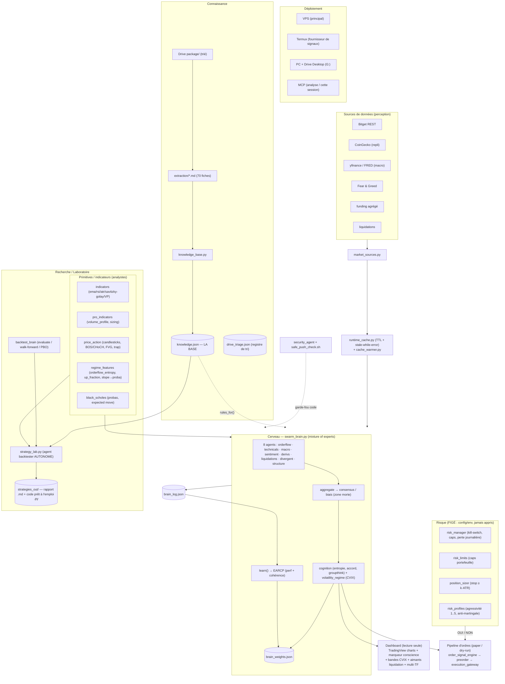

# Architecture de l'écosystème

> Schéma des postes (data / cerveau / risque / labo / connaissance / UI) et de
> leurs liaisons. Tout est **lecture seule / advisory par défaut** : aucun ordre
> réel n'est passé sans la couche risque.

## Vue Mermaid (se rend sur GitHub)



## Vue ASCII (terminal)

```
        ┌───────────── DÉPLOIEMENT ─────────────┐
        │ VPS(principal) · Termux(signaux)       │
        │ PC+Drive Desktop(G:) · MCP(analyse)    │
        └────────────────────────────────────────┘

 SOURCES (perception)                    CONNAISSANCE
 ┌──────────────────────────┐           ┌───────────────────────────┐
 │ Bitget · CoinGecko(repli) │           │ Drive package/ (trié)      │
 │ yfinance/FRED · Fear&Greed│           │   └─ extraction/*.md ──┐    │
 │ funding · liquidations    │           │ drive_triage.json      │    │
 └─────────────┬─────────────┘           │ knowledge_base.py ◄────┘    │
        market_sources.py                │   └─► knowledge.json (DB)   │
               ▼                          └─────────────┬──────────────┘
   ┌────────────────────────┐                           │ rules_for()
   │ runtime_cache (+warmer) │                          │
   └───────────┬────────────┘                           │
               ▼          primitives (analystes) ◄───────┘
        ╔═══════════════════════════════════════════════════════╗
        ║  CERVEAU  swarm_brain.py   (indicators, pro_indicators,║
        ║  price_action, regime_features, black_scholes)         ║
        ║  8 agents → aggregate → cognition+CVIX → conviction    ║
        ║  learn() → EARCP → brain_weights.json                  ║
        ║         (apprend les POIDS, jamais le RISQUE)          ║
        ╚════════╤═══════════════════════════╤══════════════════╝
                 │ advisory                   │ brain_log.json
                 ▼                            ▼
        DASHBOARD (lecture seule)      LABO  backtest_brain + strategy_lab
        charts + marqueur conscience   → strategies_out/ (rapport + code)
        bandes CVIX · aimants liq

 RISQUE (figé, config/env)                GARDE-FOUS CODE
 ┌──────────────────────────────────┐    ┌──────────────────────┐
 │ risk_manager (kill-switch, caps)  │    │ security_agent       │
 │ risk_limits · position_sizer      │    │ safe_push_check.sh   │
 │ risk_profiles (anti-martingale)   │    └──────────────────────┘
 └──────────────┬───────────────────┘
                │ OUI/NON
                ▼
   PIPELINE D'ORDRES (paper/dry-run) — AUCUN ordre réel par défaut
   order_signal_engine → preorder → execution_gateway
```

## Liaisons clés (qui parle à qui)

| De | Vers | Lien |
|---|---|---|
| Sources externes | `market_sources` → `runtime_cache` | données cachées (TTL + stale-while-error) |
| `runtime_cache` + primitives | **8 agents** (`swarm_brain`) | features de vote |
| `knowledge.json` | agents & `strategy_lab` | `kb.rules_for(...)` (règles extraites) |
| 8 agents | `aggregate` → `cognition`+CVIX | consensus, prudence, conviction ajustée |
| `brain_log.json` + prix | `learn()` → EARCP | mise à jour des **poids** (jamais le risque) |
| Cerveau | **Dashboard** | advisory (charts + marqueur conscience) |
| primitives + `backtest_brain` + KB | **`strategy_lab`** | fabrique/teste/classe/**promeut** → `strategies_out/` |
| Cerveau | **Risque** → pipeline d'ordres | OUI/NON avant tout (paper/dry-run) |

## Frontières de sécurité
- 🔒 **L'apprentissage (EARCP) ne touche QUE les poids** (`brain_weights.json`).
  Les **limites de risque** viennent de l'**env/config**, jamais apprises.
- 🔒 **Aucun ordre réel** par défaut : tout est advisory / paper / dry-run ; la
  couche risque doit dire OUI.
- 🔒 `security_agent` + `safe_push_check.sh` gardent le **code** (SAFE) avant push.
