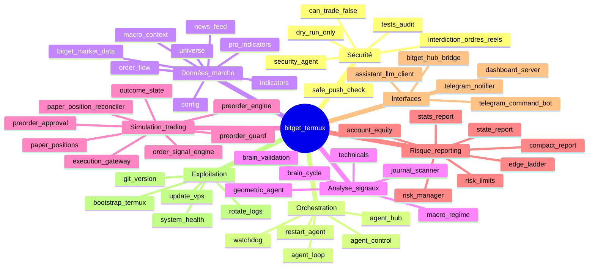
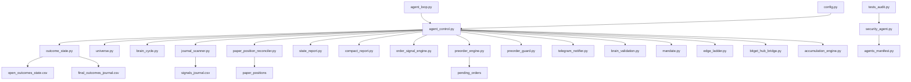

# Carte mentale et organisationnelle — bitget_termux

## Synthèse

`bitget_termux` est un agent local Termux Android pour monitoring Bitget Futures en mode paper / dry-run. Le dépôt est conçu pour analyser, journaliser, notifier et simuler des signaux sans envoyer d'ordre réel.

## Carte mentale



## Organisation fonctionnelle



## Couches du repo

### 1. Couche sécurité

Rôle : empêcher que le système devienne un bot de trading réel non contrôlé.

Fichiers principaux :

- `security_agent.py`
- `agents_manifest.py`
- `tests_audit.py`
- `safe_push_check.sh`
- `config_guard_agent.py`

Règle : les agents du manifeste sont `can_trade=False`.

### 2. Couche orchestration

Rôle : lancer les cycles, enchaîner les modules et surveiller l'exécution.

Fichiers principaux :

- `agent_loop.py`
- `agent_control.py`
- `agent_hub.py`
- `watchdog.py`
- `restart_agent.sh`

### 3. Couche données et indicateurs

Rôle : préparer l'univers, les bougies, l'order flow, les indicateurs et le contexte macro.

Fichiers principaux :

- `config.py`
- `universe.py`
- `bitget_market_data.py`
- `indicators.py`
- `pro_indicators.py`
- `order_flow.py`
- `macro_context.py`
- `macro_regime.py`
- `news_feed.py`

### 4. Couche analyse et décision paper

Rôle : transformer les données en signaux simulés.

Fichiers principaux :

- `journal_scanner.py`
- `brain_cycle.py`
- `brain_validation.py`
- `technicals.py`
- `geometric_agent.py`
- `order_signal_engine.py`

### 5. Couche pré-ordre et simulation

Rôle : transformer les signaux en pré-ordres puis en simulation paper, sans exécution réelle.

Fichiers principaux :

- `preorder_engine.py`
- `preorder_guard.py`
- `preorder_approval.py`
- `execution_gateway.py`
- `paper_positions.py`
- `paper_position_reconciler.py`
- `outcome_state.py`

### 6. Couche risque et reporting

Rôle : contrôler exposition, performance, états ouverts, résultats et rapports.

Fichiers principaux :

- `risk_manager.py`
- `risk_limits.py`
- `compact_report.py`
- `state_report.py`
- `stats_report.py`
- `account_equity.py`
- `edge_ladder.py`

### 7. Couche interfaces

Rôle : envoyer des notifications, recevoir commandes lecture seule, afficher dashboard et pont Agent Hub.

Fichiers principaux :

- `telegram_command_bot.py`
- `telegram_notifier.py`
- `dashboard/server.py`
- `bitget_hub_bridge.py`
- `assistant/llm_client.py`

## Lecture du flux principal

1. `agent_loop.py` lance un cycle régulier.
2. `agent_control.py` exécute les modules dans l'ordre.
3. Les modules de marché et cerveau produisent des signaux.
4. Les signaux sont transformés en pré-ordres simulés.
5. Les gardes-fous paper vérifient le risque.
6. Le système met à jour les positions paper et résultats.
7. Les rapports et notifications sont générés.
8. Le watchdog vérifie la fraîcheur et la présence de la boucle.

## Points de vigilance

- Le README affirme un mode paper / dry-run only.
- Le manifeste impose `can_trade=False`.
- Certaines variables de `config.py` évoquent des verrous live et accumulation réelle. Ces éléments doivent rester isolés, testés et bloqués par défaut avant toute utilisation sérieuse.
- Les fichiers runtime CSV, JSONL, journaux et secrets ne doivent pas être versionnés.
- Toute connexion exchange doit être en lecture seule au départ.

## Prochaine action recommandée

Avant toute évolution :

```bash
python tests_audit.py
python security_agent.py
python system_health.py
```

Si ces trois commandes ne retournent pas un état sûr, ne pas lancer de boucle longue et ne pas connecter de clé API.
